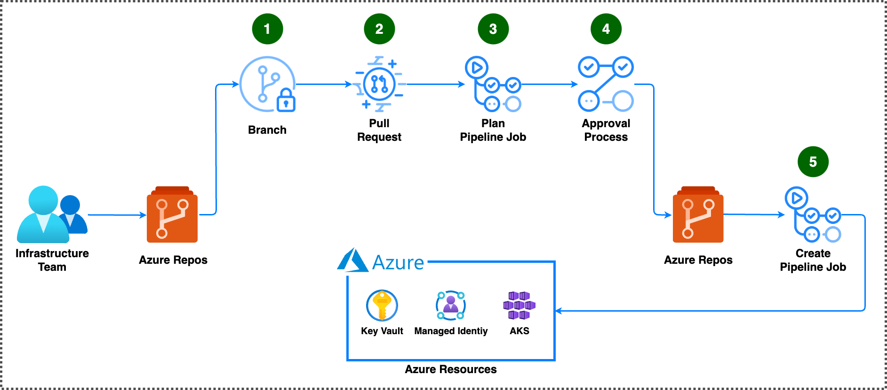

# Bicep deploy

A [pipeline](ms.azure.deploy.yml) to plan and deploy Azure infrastructure.

## Overview

1. The user creates a new branch, then commits and push the code.
1. The user creates a pull request.
1. The pipeline is automatically triggered and starts the [plan job](#plan-job).
1. If the plan job was successful, the pipeline will wait for a [required reviewer](#get-started) to approve the [deploy job](#deploy-job).
1. When a reviewer has approved, the pipeline starts the [deploy job](#deploy-job) to deploy the code.

## Get started

To use the pipeline, several prerequisite steps are required:

1. Install the [PSRule](https://marketplace.visualstudio.com/items?itemName=bewhite.ps-rule) Azure DevOps extension.

1. Create an [environment](https://learn.microsoft.com/en-us/azure/devops/pipelines/process/environments?view=azure-devops).

1. To prevent unapproved deployments, add the [**"Approvals"**](https://learn.microsoft.com/en-us/azure/devops/pipelines/process/approvals?view=azure-devops&tabs=check-pass#approvals) check to the environment.

1. Create a [Azure Resource Manager workload identity service connection](https://learn.microsoft.com/en-us/azure/devops/pipelines/release/configure-workload-identity?view=azure-devops).

1. Assign [Azure roles](https://learn.microsoft.com/en-us/azure/role-based-access-control/role-assignments-steps) to the application so it can deploy Azure infrastructure. For example, give it the **"Owner"** role on the target Azure subscription.

1. [If needed, create a repo](https://learn.microsoft.com/en-us/azure/devops/repos/git/create-new-repo?view=azure-devops#create-a-repo-using-the-web-portal).

1. In the [repo settings](https://learn.microsoft.com/en-us/azure/devops/repos/git/set-git-repository-permissions?view=azure-devops#open-security-for-a-repository), ensure the [build service](https://learn.microsoft.com/en-us/azure/devops/pipelines/process/access-tokens?view=azure-devops&tabs=yaml#manage-build-service-account-permissions) has **"Contribute to pull requests"** permission.

1. Add the [ms.azure.deploy.yml](./ms.azure.deploy.yml) to a repo folder, e.g. **".pipelines"**.

1. Customize the variable values in the **"ms.azure.deploy.yml"** file and commit the changes.

1. If needed, add [bicep](https://learn.microsoft.com/en-us/azure/azure-resource-manager/bicep/) code to the repo.

1. Add a [ps-rule.yaml](./../ps-rule.yaml) file to the same folder as the main bicep/template file or in the repository root.

1. Go to the Azure DevOps **Pipelines** page. Then choose the action to create a **New pipeline**.

1. Select **Azure Repos Git** as the location of the source code.

1. When the list of repositories appears, select the repository.

1. Select **Existing Azure Pipelines YAML file** and choose the YAML file: **"/.pipelines/ms.azure.deploy.yml"**.

1. Save the pipeline without running it.

1. Configure [branch policies](https://learn.microsoft.com/en-us/azure/devops/repos/git/branch-policies?view=azure-devops&tabs=browser#configure-branch-policies) for the default/main branch.

1. Add a [build validation branch policy](https://learn.microsoft.com/en-us/azure/devops/repos/git/branch-policies?view=azure-devops&tabs=browser#build-validation).

## Pipeline

The pipeline is designed to run when a pull request is created or updated.

The jobs in this pipeline has been tested on a [standard Microsoft-hosted agent](https://learn.microsoft.com/en-us/azure/devops/pipelines/agents/hosted?view=azure-devops&tabs=yaml#software) with YAML VM Image Label **"ubuntu-22.04"**.

The following tools are used:

- [Azure CLI](https://learn.microsoft.com/en-us/cli/azure/)
  - [az bicep build](https://learn.microsoft.com/en-us/cli/azure/bicep?view=azure-cli-latest#az-bicep-build)
  - [az bicep build-params](https://learn.microsoft.com/en-us/cli/azure/bicep?view=azure-cli-latest#az-bicep-build-params)
  - [az provider register](https://learn.microsoft.com/en-us/cli/azure/provider?view=azure-cli-latest#az-provider-register)
  - [az deployment {SCOPE} create](https://learn.microsoft.com/en-us/cli/azure/deployment/sub?view=azure-cli-latest#az-deployment-sub-create)
  - [az deployment {SCOPE} validate](https://learn.microsoft.com/en-us/cli/azure/deployment/sub?view=azure-cli-latest#az-deployment-sub-validate)
  - [az deployment {SCOPE} what-if](https://learn.microsoft.com/en-us/cli/azure/deployment/sub?view=azure-cli-latest#az-deployment-sub-what-if)
- [Azure Cost Estimator](https://github.com/TheCloudTheory/arm-estimator)
- [curl](https://curl.se/)
- Azure Pipelines task:
  - [AzureCLI@2](https://learn.microsoft.com/en-us/azure/devops/pipelines/tasks/reference/azure-cli-v2?view=azure-pipelines)
  - [checkout](https://learn.microsoft.com/en-us/azure/devops/pipelines/yaml-schema/steps-checkout?view=azure-pipelines)
  - [ps-rule-assert](https://github.com/microsoft/PSRule-pipelines/blob/main/docs/tasks.md#ps-rule-assert)
  - [publish](https://learn.microsoft.com/en-us/azure/devops/pipelines/yaml-schema/steps-publish?view=azure-pipelines)
- [GNU bash](https://www.gnu.org/software/bash/)
- [GNU bc](https://www.gnu.org/software/bc/)
- [GNU core utilities](https://www.gnu.org/software/coreutils/coreutils.html)
- [GNU find utilities](https://www.gnu.org/software/findutils/)
- [jq](https://jqlang.github.io/jq/)
- [sed](https://www.gnu.org/software/sed/)
- [unzip](https://infozip.sourceforge.net/)

### Plan job

The plan job will build and test the code. If no issues are found in the code, a [what-if](https://docs.microsoft.com/cli/azure/deployment/sub#az-deployment-sub-what-if) report is generated.

The PSRule steps will only run if **"rule_option"** is specified and points to a file that exist.

For more information about PSRule configuration, see:

- [Sample ps-rule.yaml](../ps-rule.yaml)
- [Configuring options](https://azure.github.io/PSRule.Rules.Azure/setup/configuring-options/)
- [Configuring rule defaults](https://azure.github.io/PSRule.Rules.Azure/setup/configuring-rules/)
- [Available Options](https://microsoft.github.io/PSRule/v2/concepts/PSRule/en-US/about_PSRule_Options/)
- [Available Rules by resource type](https://azure.github.io/PSRule.Rules.Azure/en/rules/resource/)

### Deploy job

The deploy job will only run when the plan job was successful.

It targets a specific [environment](#get-started).

If the environment is configured with **Approvers**, the job will require manual approval.

### Variables

- **AZURE_PROVIDERS**: A comma separated list of Azure resource providers.

  The pipeline create job will try to register the specified providers in addition to the providers that is detected in code by deployment validate.

  Use the value **"disable"** to prevent the pipeline from trying to register Azure resource providers.

- **AZURE_PROVIDER_WAIT_SECONDS**: Seconds to wait between each provider status check.

- **AZURE_PROVIDER_WAIT_COUNT**: Times to check provider status before giving up.

- **AZURE_SUBSCRIPTION_ID**: The subscription ID in which to deploy the resources.

- **COST_THRESHOLD**: Max acceptable estimated cost. Exceeding threshold causes plan to fail.

- **CURRENCY**: Currency code to use for estimations. See allowed values at <https://github.com/TheCloudTheory/arm-estimator/wiki/Options#currency>

- **ENVIRONMENT**: Name of the [environment](#get-started) to use for the [deploy job](#deploy-job).

- **LOCATION**: The Azure location to store the deployment metadata.

- **LOG_SEVERITY**: The log verbosity. Can be one of:

  - ERROR - Only show errors, suppressing warnings.
  - INFO - Standard log level.
  - VERBOSE - Increase logging verbosity.
  - DEBUG - Show all debug logs.

- **MANAGEMENT_GROUP**: Management group to create deployment at for mg scope.

- **RESOURCE_GROUP**: Resource group to create deployment at for group scope.

- **RULE_BASELINE**: The name of a PSRule baseline to use. For a list of baseline names for module PSRule.Rules.Azure see <https://azure.github.io/PSRule.Rules.Azure/en/baselines/Azure.All/>

- **RULE_MODULES**: A comma separated list of modules to use for analysis. For a list of modules see <https://www.powershellgallery.com/packages?q=Tags%3A%22PSRule-rules%22>

- **RULE_OPTION**: The path to an options file. If empty, PSRule will be skipped.

- **SCOPE**: The deployment scope. Accepted: tenant, mg, sub, group.

- **SERVICE_CONNECTION**: The Azure Resource Manager service connection name.

- **TEMPLATE**: The template address. A path or URI to a file or a template spec resource id.

- **TEMPLATE_PARAMETERS**: Deployment parameter values. Either a path, URI, JSON string, or `<KEY=VALUE>` pairs.

- **VERSION_ACE_TOOL**: Azure Cost Estimator version. If empty, cost estimator will be skipped. See versions at <https://github.com/TheCloudTheory/arm-estimator/releases>.

- **WORKFLOW_VERSION**: The version of the bicep-action scripts to use. See <https://github.com/innofactororg/bicep-action/tags>.

## License

The code and documentation in this project are released under the [BSD 3-Clause License](../LICENSE).
