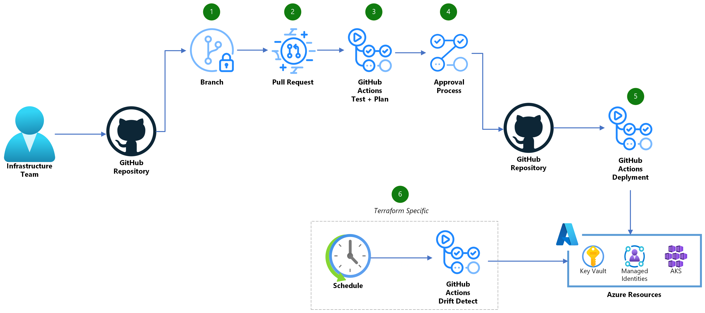

# Bicep workflow

A reusable workflow to plan and deploy Azure infrastructure.

## Getting Started

To use the workflow, several prerequisite steps are required:

1. [Create an environment](https://docs.github.com/actions/deployment/targeting-different-environments/using-environments-for-deployment#creating-an-environment).

   To prevent unapproved deployments, make sure to add **"Required reviewers"**.

   Remember to save the protection rules after making changes.

1. [Register an application with the Microsoft identity platform](https://learn.microsoft.com/en-us/entra/identity-platform/quickstart-register-app).

1. [Assign appropriate Azure roles to the application](https://learn.microsoft.com/en-us/azure/role-based-access-control/role-assignments-steps).

1. Give the workflow Azure login permission:

   - Option 1 - [Add federated credentials (recommended)](https://docs.microsoft.com/azure/developer/github/connect-from-azure?tabs=azure-portal%2Clinux#use-the-azure-login-action-with-openid-connect):

     - Use the scenario **"GitHub Actions deploying Azure resources"**.
     - Select entity type **"Pull request"**. This will allow a pull request to validate and test deployments.
     - Save the credential.
     - Add one more federated credential with the same scenario, but select entity type is **"Environment"**.
     - Specify the **"GitHub Environment name"** that is passed to the workflow, e.g. `production`.
     - Save the credential.

     Note that there is a limit of 20 federated credentials per application. For this reason, and for security reasons, it is recommended to create a separate application for each repository.

   - Option 2 - [Add client secret](https://learn.microsoft.com/en-us/entra/identity-platform/quickstart-register-app#add-a-client-secret):

     To use a **"Client secret"** instead of federated credentials, specify **"AZURE_CLIENT_SECRET"** as a secret for the workflow.

## Workflow

The workflow has two separate jobs that run independently:

- Plan: Build and test the code. Report on what will change in Azure if the code is deployed.

  The specified workflow name is used as the concurrency key for the Plan job. GitHub Actions will ensure that only one Plan workflow runs at any given time. If a new Plan workflow starts with the same name, GitHub Actions will cancel any job already running with that name.

- Deploy: Validate the deployment, register resource providers and deploy the code to Azure.

  The specified GitHub Environment name is used as the concurrency key for the Deploy job. GitHub Actions will ensure that only one Deploy job for a given environment runs at any given time. If a new Deploy job starts in the same environment, GitHub Actions will wait for completion of any job already running for that environment name, before starting the job.

### Plan

Each time a **pull request** is created or updated, the workflow will build and test the code. If no issues are found in the code, a [what-if](https://docs.microsoft.com/cli/azure/deployment/sub#az-deployment-sub-what-if) report is generated for easy review.

The job is done using the following tools:

- [Azure CLI](https://learn.microsoft.com/en-us/cli/azure/)
  - [az bicep build](https://learn.microsoft.com/en-us/cli/azure/bicep?view=azure-cli-latest#az-bicep-build)
  - [az bicep build-params](https://learn.microsoft.com/en-us/cli/azure/bicep?view=azure-cli-latest#az-bicep-build-params)
  - [az deployment {SCOPE} what-if](https://learn.microsoft.com/en-us/cli/azure/deployment/sub?view=azure-cli-latest#az-deployment-sub-what-if)
- [microsoft/ps-rule@v2](https://github.com/microsoft/ps-rule)
- [azure-cost-estimator](https://github.com/TheCloudTheory/arm-estimator)

### Deploy

The workflow can be started manually (**workflow dispatch**) or automatically when a **pull request review** is submitted with an **approved** state.

This job targets a specific [environment](#getting-started). If **required reviewers** have been added, the deployment job will only run after manual approval from one of the specified approvers.

When started, the workflow will [deploy](https://docs.microsoft.com/cli/azure/deployment/sub#az-deployment-sub-create) the code to Azure.

The job is done using the following tools:

- [Azure CLI](https://learn.microsoft.com/en-us/cli/azure/)
  - [az deployment {SCOPE} validate](https://learn.microsoft.com/en-us/cli/azure/deployment/sub?view=azure-cli-latest#az-deployment-sub-validate)
  - [az provider register](https://learn.microsoft.com/en-us/cli/azure/provider?view=azure-cli-latest#az-provider-register)
  - [az deployment {SCOPE} create](https://learn.microsoft.com/en-us/cli/azure/deployment/sub?view=azure-cli-latest#az-deployment-sub-create)



1. Create a new branch and check in the needed code.
1. Create a Pull Request (PR) in GitHub once the changes are ready.
1. A GitHub Actions job will ensure that the code is valid and internally consistent. In addition, a What-If analysis will run to generate a preview of the changes that will happen in Azure.
1. The Pull Request must be reviewed and approved before it can be deployed.
1. A GitHub Actions job will validate and deploy the code.

## Usage

Note that the workflow below should be modified to match specific requirements.

For example:

- Use `name: Deploy Governance` for a workflow that deploys governance resources to Azure.
- Use `branches: [main, dev]` for starting the workflow on pull requests to both main and dev branch.
- Use `paths: ["gov/*.bicep", "gov/*.bicepparam"]` for starting the workflow when change occur to a .bicep or .bicepparam file within the root of the gov directory, at the root of the repository.
- Use `paths: ["main.json", "main.parameters.json"]` for starting the workflow when change occur to main.json or main.parameters.json within the root of the repository.
- Use `paths: ["**.bicep", "**.bicepparam", "!modules/**"]` for starting the workflow when change occur to a .bicep or .bicepparam file anywhere in the repository except under the modules folder.

<!-- start usage -->

```yaml
name: Azure Deploy
on:
  workflow_dispatch:
    inputs:
      job:
        default: Plan
        type: choice
        options: [Plan, Deploy]

  pull_request:
    types: [opened, synchronize]
    branches: [main]
    paths: ["bicep/**.bicep*"]

  pull_request_review:
    types: [submitted]

permissions: {}

jobs:
  deploy:
    name: 🔧 Bicep
    uses: innofactororg/bicep-action/.github/workflows/bootstrap.yml@v1
    permissions:
      id-token: write # for Log in to Azure (Federated)
      contents: write # for Auto Merge
      pull-requests: write # for Comment when done
    secrets:
      # The service principal secret used for Azure login.
      #
      # This secret is optional and only needed as an alternative to
      # federated credentials.
      #
      # Note: Don't add this secret if you want to use federated credentials.
      #
      AZURE_CLIENT_SECRET: ${{ secrets.AZURE_APP1_CLIENT_SECRET }}
    with:
      # The GitHub environment name for the Azure deploy job.
      #
      # Default: production
      environment: production

      # The tenant ID in which the subscription exists.
      #
      # Required
      azure_tenant_id: d0d0d0d0-b93b-4f96-9e73-4ea6caa2f3b4

      # The client ID of the service principal for Azure login.
      #
      # This service principal must have permission to deploy within the
      # Azure subscription.
      #
      # Required
      azure_client_id: d0d0d0d0-4558-43bb-896a-008e763058bd

      # The subscription ID in which to deploy the resources.
      #
      # Required
      azure_subscription_id: d0d0d0d0-ed29-4694-ac26-2e358c364506

      # The Azure location to store the deployment metadata.
      #
      # Default: westeurope
      location: westeurope

      # The deployment scope. Accepted: tenant, mg, sub, group.
      #
      # Default: sub
      scope: sub

      # Management group to create deployment at for mg scope.
      #
      # Default: ''
      management_group:

      # Resource group to create deployment at for group scope.
      #
      # Default: ''
      resource_group:

      # The template address.
      #
      # A path or URI to the a file or a template spec resource id.
      #
      # Default: main.bicep
      code_template: main.bicep

      # Deployment parameter values.
      #
      # Either a path, URI, JSON string, or <KEY=VALUE> pairs.
      #
      # Default: ''
      parameters: main.bicepparam

      # A comma separated list of Azure resource providers.
      #
      # The workflow will try to register the specified providers in addition
      # to the providers that is detected in code by deployment validate.
      #
      # Default: ''
      azure_providers: Microsoft.Advisor,microsoft.support

      # Seconds to wait between each provider status check.
      #
      # Default: 10
      azure_provider_wait_seconds: 10

      # Times to check provider status before giving up.
      #
      # Default: 30
      azure_provider_wait_count: 30

      # A comma separated list of modules to use for analysis.
      #
      # For a list of modules see
      # https://www.powershellgallery.com/packages?q=Tags%3A%22PSRule-rules%22
      #
      # Default: Az.Resources,PSRule.Rules.Azure
      psrule_modules: Az.Resources,PSRule.Rules.CAF

      # The name of a PSRule baseline to use.
      #
      # For a list of baseline names for module PSRule.Rules.Azure see
      # https://azure.github.io/PSRule.Rules.Azure/en/baselines/Azure.All/
      #
      # Default: Azure.Default
      psrule_baseline: Azure.GA_2023_12

      # Ignore rules for PSRule analysis.
      #
      # A comma separated list of specific rules to exclude from evaluation.
      #
      # Default: ''
      psrule_exclude: Azure.Template.UseDescriptions,Azure.Resource.UseTags,Azure.ACR.MinSku

      # A comma separated list of paths to ignore for analysis.
      #
      # Default: 'bicepconfig.json,modules/**/*.bicep'
      psrule_path_ignore: bicepconfig.json,modules/**/*.bicep

      # Azure Cost Estimator version.
      #
      # The version to use for cost estimation. See versions at
      # https://github.com/TheCloudTheory/arm-estimator/releases
      #
      # Default: '1.4-beta2'
      ace_version: "1.4-beta2"

      # Currency code to use for estimations.
      #
      # See allowed values at
      # https://github.com/TheCloudTheory/arm-estimator/wiki/Options#currency
      #
      # Default: 'EUR'
      ace_currency: USD

      # Max acceptable estimated cost.
      #
      # Exceeding threshold causes plan to fail.
      #
      # Default: -1
      ace_threshold: 1000

      # Allow deployment on commented and approved review.
      #
      # When set to false, deployment will start on approved review.
      # Set to true to allow deployment to start on commented review.
      #
      # Default: false
      deploy_on_review_comment: true

      # Auto merge method to use after successful deployment.
      #
      # Can be one of: merge, squash, rebase or disable (turn off auto merge).
      #
      # Default: squash
      auto_merge: disable

      # Job to run when using workflow_dispatch.
      #
      # Default: Plan
      workflow_dispatch_job: ${{ github.event.inputs.job }}

      # The log verbosity. Can be one of:
      #
      # ERROR - Only show errors, suppressing warnings. Dump context at fail.
      # INFO - Standard log level. Always dump context.
      # VERBOSE - Increase logging verbosity. Always dump context.
      # DEBUG - Show all debug logs. Always dump context.
      #
      # Default: ERROR
      log_severity: INFO
```

<!-- end usage -->

### Usage example

<!-- start usage example -->

```yaml
name: Azure Deploy
on:
  workflow_dispatch:
    inputs:
      job:
        default: Plan
        type: choice
        options: [Plan, Deploy]

  pull_request:
    types: [opened, synchronize]
    branches: [main]
    paths: ["bicep/main.bicep", "bicep/main.bicepparam"]

  pull_request_review:
    types: [submitted]

permissions: {}

jobs:
  deploy:
    name: 🔧 Bicep
    uses: innofactororg/bicep-action/.github/workflows/bootstrap.yml@v1
    permissions:
      id-token: write
      contents: write
      pull-requests: write
    with:
      environment: production
      azure_tenant_id: e0bf45f5-b93b-4f96-9e73-4ea6caa2f3b4
      azure_client_id: 6a31b6a2-4558-43bb-896a-008e763058bd
      azure_subscription_id: aeac59a3-67af-474b-ac4a-67ee18414df1
      location: westeurope
      scope: sub
      code_template: main.bicep
      parameters: main.bicepparam
      azure_providers: Microsoft.Advisor,Microsoft.AlertsManagement,Microsoft.Authorization,Microsoft.Consumption,Microsoft.EventGrid,microsoft.insights,Microsoft.ManagedIdentity,Microsoft.Management,Microsoft.Network,Microsoft.PolicyInsights,Microsoft.ResourceHealth,Microsoft.Resources,Microsoft.Security
      psrule_exclude: Azure.Template.UseDescriptions,Azure.Resource.UseTags,Azure.Storage.SoftDelete,Azure.Storage.ContainerSoftDelete,Azure.Storage.Firewall
      ace_threshold: 500
      workflow_dispatch_job: ${{ github.event.inputs.job }}
      log_severity: INFO
```

<!-- end usage example -->

## Branch protection

It is recommended to protect the default branch. This is done in the repository settings under **Branches**.

For production use, the following settings are recommended:

- Require a pull request before merging
  - Require approvals
  - Dismiss stale pull request approvals when new commits are pushed
  - Require approval of the most recent reviewable push
- Require status checks to pass before merging
  - Require branches to be up to date before merging
  - Add the following status checks:
    - 🔧 Bicep / 🗓️ Plan
    - 🔧 Bicep / 🏃 Deploy
- Require conversation resolution before merging
- Require linear history
- Require deployments to succeed before merging (and select the environment that must succeed)

This ensures that no changes to the pull request are possible between the approval and the merging and that a successful plan and deploy has occurred.

## Auto merge

To allow pull requests to merge automatically once all required reviews and status checks have passed, enable **Allow auto-merge** in the repository settings under **General**. Ensure branch protection is configured as described above.

## Passing secret as input

If the input value is stored as a secret, it can still be passed using the needs syntax.

In the following example, a secret called **AZURE_APP1_TENANT_ID** is passed to the input **azure_tenant_id**:

```yaml
name: Azure Deploy
on:
  workflow_dispatch:
    inputs:
      job:
        default: Plan
        type: choice
        options: [Plan, Deploy]

  pull_request:
    types: [opened, synchronize]
    branches: [main]
    paths: ["bicep/**.bicep*"]

  pull_request_review:
    types: [submitted]

permissions: {}

jobs:
  vars:
    name: vars
    runs-on: ubuntu-latest
    env:
      TENANT_ID: ${{ secrets.AZURE_APP1_TENANT_ID }}
    outputs:
      TENANT_ID: ${{ env.TENANT_ID }}
    steps:
      - run: echo 'Exposing secrets as env vars'
  deploy:
    name: 🔧 Bicep
    needs: vars
    uses: innofactororg/bicep-action/.github/workflows/bootstrap.yml@v1
    permissions:
      id-token: write
      contents: write
      pull-requests: write
    with:
      environment: sandbox1
      azure_tenant_id: ${{ needs.vars.outputs.TENANT_ID }}
      azure_client_id: 6a31b6a2-4558-43bb-896a-008e763058bd
      azure_subscription_id: aeac59a3-67af-474b-ac4a-67ee18414df1
      location: westeurope
      scope: sub
      code_template: main.bicep
      parameters: main.bicepparam
      workflow_dispatch_job: ${{ github.event.inputs.job }}
      log_severity: INFO
```

## License

The code and documentation in this project are released under the [MIT License](LICENSE).
