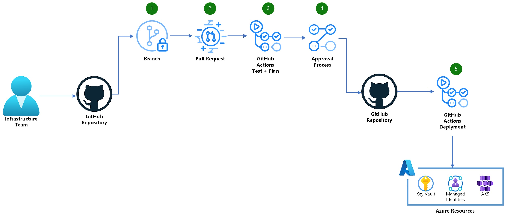

# Bicep deploy workflow

Reusable workflow to plan and deploy Azure infrastructure.

## Overview



1. A user creates a new branch, then commits and push the code.
1. A user creates a pull request.
1. The plan job is automatically triggered.
1. If the plan job was successful, the workflow will wait for a required reviewer (if configured) to approve the deployment.
1. When a reviewer has approved, the workflow deploys the code.

## Get started

To use the workflow, several prerequisite steps are required:

1. [Create an environment](https://docs.github.com/actions/deployment/targeting-different-environments/using-environments-for-deployment#creating-an-environment).

   To prevent unapproved deployments, make sure to add **"Required reviewers"**.

   Remember to save the protection rules after making changes.

1. [Register an application with the Microsoft identity platform](https://learn.microsoft.com/en-us/entra/identity-platform/quickstart-register-app).

1. [Assign appropriate Azure roles to the application](https://learn.microsoft.com/en-us/azure/role-based-access-control/role-assignments-steps).

1. Give the workflow Azure login permission:

   - **Option 1**: [Add federated credentials (recommended)](https://docs.microsoft.com/azure/developer/github/connect-from-azure?tabs=azure-portal%2Clinux#use-the-azure-login-action-with-openid-connect)

     - Use the scenario **"GitHub Actions deploying Azure resources"**.
     - Select entity type **"Pull request"** (needed for the [plan job](#plan-job)).
     - Save the credential.
     - Add another federated credential with the scenario **"GitHub Actions deploying Azure resources"**.
     - Select entity type **"Environment"** (needed for the [create job](#create-job)).
     - Specify the environment name that the workflow use.
     - Save the credential.

     Note that there is a limit of 20 federated credentials per application. For this reason, and for security reasons, it is recommended to create a separate application for each repository.

   - **Option 2**: [Add client secret](https://learn.microsoft.com/en-us/entra/identity-platform/quickstart-register-app#add-a-client-secret)

     - Use this option instead of federated credentials.
     - Create a secret for the app. Remember that the secret must be replaced when it expires.
     - Specify **"AZURE_CLIENT_SECRET"** as a secret for the workflow.

### Auto merge

To allow pull requests to merge automatically once all required reviews and status checks have passed, enable **"Allow auto-merge"** in the repository settings under **"General"**.

For auto merge to work properly, [branch protection](#branch-protection) must be configured.

### Branch protection

It is recommended to protect the default branch. This is done in the repository settings under **"Branches"**.

Recommended branch protection for production use:

- Require a pull request before merging
  - Require approvals
  - Dismiss stale pull request approvals when new commits are pushed
  - Require approval of the most recent reviewable push
- Require status checks to pass before merging
  - Require branches to be up to date before merging
  - Add the following status checks:
    - 🔧 Deploy / 🗓️ Plan
    - 🔧 Deploy / 🏃 Create
- Require conversation resolution before merging
- Require linear history
- Require deployments to succeed before merging (and select the environment that must succeed)

This ensures that no changes to the pull request are possible between the approval and the merging and that a successful plan and deploy has occurred.

## Workflow

The workflow name is used to ensure that only one deploy workflow runs at any given time. If a new workflow starts with the same name, GitHub Actions will cancel any workflow already running with that name.

### Plan job

The plan job will build and test the code. If no issues are found in the code, a [what-if](https://docs.microsoft.com/cli/azure/deployment/sub#az-deployment-sub-what-if) report is generated.

The plan job use the following tools:

- [Azure CLI](https://learn.microsoft.com/en-us/cli/azure/)
  - [az login](https://learn.microsoft.com/en-us/cli/azure/reference-index?view=azure-cli-latest#az-login)
  - [az bicep build](https://learn.microsoft.com/en-us/cli/azure/bicep?view=azure-cli-latest#az-bicep-build)
  - [az bicep build-params](https://learn.microsoft.com/en-us/cli/azure/bicep?view=azure-cli-latest#az-bicep-build-params)
  - [az deployment {SCOPE} validate](https://learn.microsoft.com/en-us/cli/azure/deployment/sub?view=azure-cli-latest#az-deployment-sub-validate)
  - [az deployment {SCOPE} what-if](https://learn.microsoft.com/en-us/cli/azure/deployment/sub?view=azure-cli-latest#az-deployment-sub-what-if)
- [microsoft/ps-rule@v2](https://github.com/microsoft/ps-rule)
- [azure-cost-estimator](https://github.com/TheCloudTheory/arm-estimator)

The PSRule step will only run if the repository has a **"ps-rule.yaml"** file in the root.

For more information about PSRule configuration, see:

- [Sample ps-rule.yaml](ps-rule.yaml)
- [Configuring options](https://azure.github.io/PSRule.Rules.Azure/setup/configuring-options/)
- [Options](https://microsoft.github.io/PSRule/v2/concepts/PSRule/en-US/about_PSRule_Options/)
- [Rules by resource type](https://azure.github.io/PSRule.Rules.Azure/en/rules/resource/)

### Create job

The create job requires that the plan job was successfully completed and targets a specific [environment](#get-started). If the environment is configured with **required reviewers**, the job will require manual approval.

The create job use the following tools:

- [Azure CLI](https://learn.microsoft.com/en-us/cli/azure/)
  - [az login](https://learn.microsoft.com/en-us/cli/azure/reference-index?view=azure-cli-latest#az-login)
  - [az provider register](https://learn.microsoft.com/en-us/cli/azure/provider?view=azure-cli-latest#az-provider-register)
  - [az deployment {SCOPE} create](https://learn.microsoft.com/en-us/cli/azure/deployment/sub?view=azure-cli-latest#az-deployment-sub-create)

### Passing secrets

If the value of **"azure_tenant_id"**, **"azure_client_id"** or **"azure_subscription_id"** is stored as a secret, it can be passed using the secrets syntax.

Note that secrets are masked in the job log. The result is that IDs can't be seen and it may be difficult to see if the wrong ID is used.

```yaml
name: Azure Deploy
on:
  pull_request:
    types: [opened, synchronize]
    branches: [main]
    paths: ["bicep/**.bicep*"]

permissions: {}

jobs:
  deploy:
    name: 🔧 Deploy
    uses: innofactororg/bicep-action/.github/workflows/deploy.yml@v1
    permissions:
      id-token: write
      contents: write
      pull-requests: write
    secrets:
      AZURE_TENANT_ID: ${{ secrets.TENANT_ID }}
      AZURE_CLIENT_ID: ${{ secrets.CLIENT_ID }}
      AZURE_SUBSCRIPTION_ID: ${{ secrets.SUBSCRIPTION_ID }}
      AZURE_CLIENT_SECRET: ${{ secrets.CLIENT_SECRET }}
    with:
      environment: sandbox1
      location: westeurope
      scope: sub
      code_template: main.bicep
      parameters: main.bicepparam
      log_severity: INFO
```

### Usage

```yaml
name: Azure Deploy
on:
  pull_request:
    types: [opened, synchronize]
    branches: [main]
    paths: ["bicep/**.bicep*"]

permissions: {}

jobs:
  deploy:
    name: 🔧 Deploy
    uses: innofactororg/bicep-action/.github/workflows/deploy.yml@v1
    permissions:
      id-token: write # for Log in to Azure (Federated)
      contents: write # for Auto Merge
      pull-requests: write # for Comment when done
    secrets:
      # The tenant ID in which the subscription exists.
      #
      # Required if input azure_tenant_id is not specified.
      # Ignored if input azure_tenant_id is specified.
      AZURE_TENANT_ID: ${{ secrets.TENANT_ID }}

      # The client ID of the service principal for Azure login.
      #
      # This service principal must have permission to deploy within the
      # Azure subscription.
      #
      # Required if input azure_client_id is not specified.
      # Ignored if input azure_client_id is specified.
      AZURE_CLIENT_ID: ${{ secrets.CLIENT_ID }}

      # The subscription ID in which to deploy the resources.
      #
      # Required if input azure_subscription_id is not specified.
      # Ignored if input azure_subscription_id is specified.
      AZURE_SUBSCRIPTION_ID: ${{ secrets.SUBSCRIPTION_ID }}

      # The service principal secret used for Azure login.
      #
      # Note: Don't add this secret if you want to use federated credentials.
      #
      # Optional: only needed as an alternative to federated credentials.
      AZURE_CLIENT_SECRET: ${{ secrets.CLIENT_SECRET }}
    with:
      # The GitHub environment name for the Azure deploy job.
      #
      # Default: production
      environment: production

      # The tenant ID in which the subscription exists.
      #
      # Required if secret AZURE_TENANT_ID is not specified.
      azure_tenant_id: d0d0d0d0-b93b-4f96-9e73-4ea6caa2f3b4

      # The client ID of the service principal for Azure login.
      #
      # This service principal must have permission to deploy within the
      # Azure subscription.
      #
      # Required if secret AZURE_CLIENT_ID is not specified.
      azure_client_id: d0d0d0d0-4558-43bb-896a-008e763058bd

      # The subscription ID in which to deploy the resources.
      #
      # Required if secret AZURE_SUBSCRIPTION_ID is not specified.
      azure_subscription_id: d0d0d0d0-ed29-4694-ac26-2e358c364506

      # The Azure location to store the deployment metadata.
      #
      # Default: westeurope
      location: westeurope

      # The deployment scope. Accepted: tenant, mg, sub, group.
      #
      # Default: sub
      scope: sub

      # Management group to create deployment at for mg scope.
      #
      # Default: ''
      management_group:

      # Resource group to create deployment at for group scope.
      #
      # Default: ''
      resource_group:

      # The template address.
      #
      # A path or URI to the a file or a template spec resource id.
      #
      # Default: main.bicep
      code_template: main.bicep

      # Deployment parameter values.
      #
      # Either a path, URI, JSON string, or <KEY=VALUE> pairs.
      #
      # Default: ''
      parameters: main.bicepparam

      # A comma separated list of Azure resource providers.
      #
      # The workflow will try to register the specified providers in addition
      # to the providers that is detected in code by deployment validate.
      #
      # Default: ''
      azure_providers: Microsoft.Advisor,microsoft.support

      # Seconds to wait between each provider status check.
      #
      # Default: 10
      azure_provider_wait_seconds: 10

      # Times to check provider status before giving up.
      #
      # Default: 30
      azure_provider_wait_count: 30

      # Auto merge method to use after successful deployment.
      #
      # Can be one of: merge, squash, rebase or disable (turn off auto merge).
      #
      # Default: squash
      auto_merge: disable

      # Azure Cost Estimator version.
      #
      # The version to use for cost estimation. See versions at
      # https://github.com/TheCloudTheory/arm-estimator/releases
      #
      # Default: '1.4-beta2'
      ace_version: "1.4-beta2"

      # Currency code to use for estimations.
      #
      # See allowed values at
      # https://github.com/TheCloudTheory/arm-estimator/wiki/Options#currency
      #
      # Default: 'EUR'
      ace_currency: USD

      # Max acceptable estimated cost.
      #
      # Exceeding threshold causes plan to fail.
      #
      # Default: -1
      ace_threshold: 1000

      # The name of a PSRule baseline to use.
      #
      # For a list of baseline names for module PSRule.Rules.Azure see
      # https://azure.github.io/PSRule.Rules.Azure/en/baselines/Azure.All/
      #
      # Default: Azure.Default
      psrule_baseline: Azure.GA_2023_12

      # A comma separated list of modules to use for analysis.
      #
      # For a list of modules see
      # https://www.powershellgallery.com/packages?q=Tags%3A%22PSRule-rules%22
      #
      # Default: Az.Resources,PSRule.Rules.Azure
      psrule_modules: Az.Resources,PSRule.Rules.CAF

      # The log verbosity. Can be one of:
      #
      # ERROR - Only show errors, suppressing warnings. Dump context at fail.
      # INFO - Standard log level. Always dump context.
      # VERBOSE - Increase logging verbosity. Always dump context.
      # DEBUG - Show all debug logs. Always dump context.
      #
      # Default: ERROR
      log_severity: INFO
```

## License

The code and documentation in this project are released under the [MIT License](LICENSE).
