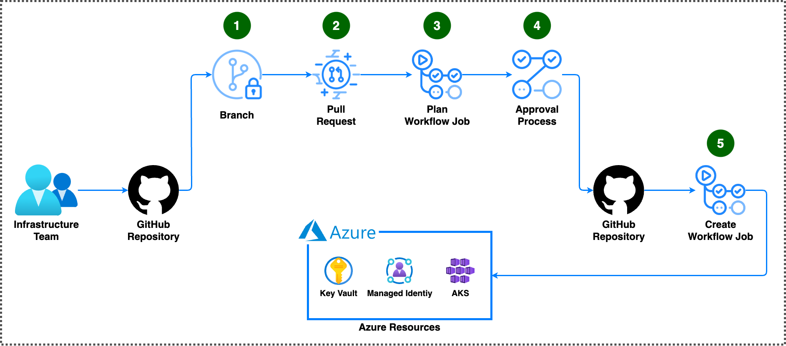

# Bicep deploy

This repository includes GitHub actions and a Azure DevOps [pipeline](./.azuredevops/README.md) to plan and deploy Azure infrastructure.

## Overview



1. The user creates a new branch, then commits and push the code.
1. The user creates a pull request.
1. The workflow is automatically triggered and starts the [plan job](#plan-job).
1. If the plan job was successful, the workflow will wait for a [required reviewer](#get-started) to approve the [deploy job](#deploy-job).
1. When a reviewer has approved, the workflow starts the [deploy job](#deploy-job) to deploy the code.

## Get started

To set up a bicep deploy workflow, several prerequisite steps are required:

1. Create an [environment](https://docs.github.com/actions/deployment/targeting-different-environments/using-environments-for-deployment#creating-an-environment).

1. To prevent unapproved deployments, add **"Required reviewers"** to the environment. Remember to save the protection rules after making changes.

1. Register a [Microsoft identity platform application](https://learn.microsoft.com/en-us/entra/identity-platform/quickstart-register-app).

1. Assign [Azure roles](https://learn.microsoft.com/en-us/azure/role-based-access-control/role-assignments-steps) to the application so it can deploy Azure infrastructure. For example, give it the **"Owner"** role on the target Azure subscription.

1. Give the repository Azure login permission:

   - **Option 1**: Add [federated credentials](https://docs.microsoft.com/azure/developer/github/connect-from-azure?tabs=azure-portal%2Clinux#use-the-azure-login-action-with-openid-connect) (recommended)

     - Use the scenario **"GitHub Actions deploying Azure resources"**.
     - Select entity type **"Pull request"** (needed for the [plan job](#plan-job)).
     - Save the credential.
     - Add another federated credential with the scenario **"GitHub Actions deploying Azure resources"**.
     - Select entity type **"Environment"** (needed for the [deploy job](#deploy-job)).
     - Specify the environment name that was created in step 1.
     - Save the credential.

     Note that there is a limit of 20 federated credentials per application. For this reason, and for security reasons, it is recommended to create a separate application for each repository.

   - **Option 2**: Add [client secret](https://learn.microsoft.com/en-us/entra/identity-platform/quickstart-register-app#add-a-client-secret)

     - Add the secret from the app registration as a secret in the repository. Remember that the secret must be replaced when it expires.
     - Add **"AZURE_CLIENT_SECRET"** to the workflow, see [passing secrets](#passing-secrets).

### Auto merge

To allow pull requests to merge automatically once all required reviews and status checks have passed, enable **"Allow auto-merge"** in the repository settings under **"General"**.

To clean up the head branch after merge, enable **"Automatically delete head branches"** on the same page.

For auto merge to work as intended, enable [branch protection](#branch-protection).

### Branch protection

It is recommended to protect the default branch. This is done in the repository settings under **"Branches"**.

Recommended branch protection for production use:

- Require a pull request before merging
  - Require approvals
  - Dismiss stale pull request approvals when new commits are pushed
  - Require approval of the most recent reviewable push
- Require status checks to pass before merging
  - Require branches to be up to date before merging
  - Add the following status checks:
    - 🏃 Deploy
- Require conversation resolution before merging
- Require linear history
- Require deployments to succeed before merging (and select the environment that must succeed)

This ensures that no changes to the pull request are possible between the approval and the merging and that a successful plan and deploy has occurred.

## Workflow

The workflow is designed to run when a pull request is created or updated.

It has been tested on a [standard GitHub-hosted runner](https://docs.github.com/en/actions/using-github-hosted-runners/about-github-hosted-runners/about-github-hosted-runners#standard-github-hosted-runners-for-public-repositories) with workflow label **"ubuntu-22.04"**.

The concurrency setting is configured to ensure that only one workflow runs at any given time. If a new workflow starts with the same name, GitHub Actions will cancel any workflow already running with that name.

The following tools are used:

- [Azure CLI](https://learn.microsoft.com/en-us/cli/azure/)
  - [az login](https://learn.microsoft.com/en-us/cli/azure/reference-index?view=azure-cli-latest#az-login)
  - [az bicep build](https://learn.microsoft.com/en-us/cli/azure/bicep?view=azure-cli-latest#az-bicep-build)
  - [az bicep build-params](https://learn.microsoft.com/en-us/cli/azure/bicep?view=azure-cli-latest#az-bicep-build-params)
  - [az provider register](https://learn.microsoft.com/en-us/cli/azure/provider?view=azure-cli-latest#az-provider-register)
  - [az deployment {SCOPE} create](https://learn.microsoft.com/en-us/cli/azure/deployment/sub?view=azure-cli-latest#az-deployment-sub-create)
  - [az deployment {SCOPE} validate](https://learn.microsoft.com/en-us/cli/azure/deployment/sub?view=azure-cli-latest#az-deployment-sub-validate)
  - [az deployment {SCOPE} what-if](https://learn.microsoft.com/en-us/cli/azure/deployment/sub?view=azure-cli-latest#az-deployment-sub-what-if)
- [Azure Cost Estimator](https://github.com/TheCloudTheory/arm-estimator)
- [curl](https://curl.se/)
- GitHub actions:
  - [checkout](https://github.com/actions/checkout/tree/b4ffde65f46336ab88eb53be808477a3936bae11)
  - [github-script](https://github.com/actions/github-script/tree/60a0d83039c74a4aee543508d2ffcb1c3799cdea)
  - [microsoft/ps-rule](https://github.com/microsoft/ps-rule/tree/001a0fcdab97b1d83e25c559163ecececc80cc6f)
  - [upload-artifact](https://github.com/actions/upload-artifact/tree/ef09cdac3e2d3e60d8ccadda691f4f1cec5035cb)
- [GNU bash](https://www.gnu.org/software/bash/)
- [GNU bc](https://www.gnu.org/software/bc/)
- [GNU core utilities](https://www.gnu.org/software/coreutils/coreutils.html)
- [GNU find utilities](https://www.gnu.org/software/findutils/)
- [jq](https://jqlang.github.io/jq/)
- [sed](https://www.gnu.org/software/sed/)
- [unzip](https://infozip.sourceforge.net/)

### Plan job

The plan job will build and test the code. If no issues are found in the code, a [what-if](https://docs.microsoft.com/cli/azure/deployment/sub#az-deployment-sub-what-if) report is generated.

The PSRule steps will only run if **"rule_option"** is specified and points to a file that exist.

For more information about PSRule configuration, see:

- [Sample ps-rule.yaml](./ps-rule.yaml)
- [Configuring options](https://azure.github.io/PSRule.Rules.Azure/setup/configuring-options/)
- [Configuring rule defaults](https://azure.github.io/PSRule.Rules.Azure/setup/configuring-rules/)
- [Available Options](https://microsoft.github.io/PSRule/v2/concepts/PSRule/en-US/about_PSRule_Options/)
- [Available Rules by resource type](https://azure.github.io/PSRule.Rules.Azure/en/rules/resource/)

### Deploy job

The deploy job will only run when the plan job was successful.

A specific [environment](#get-started) must be specified for this job.

If the environment is configured with **required reviewers**, the job will require manual approval.

### Passing secrets

It is optional to pass **"azure_client_id"**, **"azure_subscription_id"** and **"azure_tenant_id"** as secret.

Secrets are masked in the job log. The result is that IDs can't be seen and it may be difficult to see if the wrong ID is used.

On the other hand, passing these values as secrets will make them less exposed and is therefore the more secure option.

When using **"Option 2"** in [Get started](#get-started), the input **"azure_client_secret"** is needed and must be passed as a secret.

Secrets are passed using the secrets syntax, for example:

```yaml
with:
  azure_client_id: ${{ secrets.AZURE_CLIENT_ID }}
  azure_client_secret: ${{ secrets.AZURE_CLIENT_SECRET }}
  azure_subscription_id: ${{ secrets.AZURE_SUBSCRIPTION_ID }}
  azure_tenant_id: ${{ secrets.AZURE_TENANT_ID }}
```

### Action Inputs

#### Required

- **azure_client_id**: (Required) The client ID of the service principal for Azure login.

  This service principal must have permission to deploy within the Azure subscription.

- **azure_subscription_id**: (Required) The subscription ID in which to deploy the resources.

- **azure_tenant_id**: (Required) The tenant ID in which the subscription exists.

- **location**: (Required) The Azure location to store the deployment metadata.

- **scope**: (Required) The deployment scope. Accepted: tenant, mg, sub, group.

- **template**: (Required) The template address. A path or URI to a file or a template spec resource id.

#### Optional

- **artifact_identifier**: A unique identifier added to artifact name in case of multiple runs within one workflow.

- **auto_merge**: Auto merge method to use after successful deployment.

  Can be one of:

  - merge
  - squash
  - rebase
  - disable (turn off auto merge)

  Default: **"squash"**

- **azure_providers**: A comma separated list of Azure resource providers.

  The workflow will try to register the specified providers in addition to the providers that is detected in code by deployment validate.

  Use the value **"disable"** to prevent the workflow from trying to register Azure resource providers.

  Default: **""**

- **azure_provider_wait_count**: Times to check provider status before giving up.

  Default: **"30"**

- **azure_provider_wait_seconds**: Seconds to wait between each provider status check.

  Default: **"10"**

- **cost_threshold**: Max acceptable estimated cost. Exceeding threshold causes plan to fail.

  A value of **"-1"** means no cost threshold.

  Default: **"-1"**

- **currency**: Currency code to use for estimations.

  See allowed values at <https://github.com/TheCloudTheory/arm-estimator/wiki/Options#currency>

  Default: **"EUR"**

- **log_severity**: The log verbosity. Can be one of:

  - **ERROR**: Only show errors, suppressing warnings.
  - **INFO**: Standard log level.
  - **VERBOSE**: Increase logging verbosity.
  - **DEBUG**: Show all debug logs.

  Default: **ERROR**

- **management_group**: Management group to create deployment at for mg scope.

  Default: **""**

- **resource_group**: Resource group to create deployment at for group scope.

  Default: **""**

- **rule_baseline**: The name of a PSRule baseline to use.

  For a list of baseline names for module PSRule.Rules.Azure see <https://azure.github.io/PSRule.Rules.Azure/en/baselines/Azure.All/>

  Default: **Azure.Default**

- **rule_modules**: A comma separated list of modules to use for analysis.

  For a list of modules see <https://www.powershellgallery.com/packages?q=Tags%3A%22PSRule-rules%22>

  Default: **Az.Resources,PSRule.Rules.Azure**

- **rule_option**: The path to an options file. If empty, PSRule will be skipped.

  For example: `bicep/pattern1/ps-rule.prod.yaml`

  Default: **""**

- **template_parameters**: Deployment parameter values.

  Either a path, URI, JSON string, or <KEY=VALUE> pairs.

  For example: `bicep/pattern1/main.prod.bicepparam`

  Default: **""**

- **version_ace_tool**: Azure Cost Estimator version. If empty, cost estimator will be skipped.

  See versions at <https://github.com/TheCloudTheory/arm-estimator/releases>.

  Default: **"1.6"**

### Usage

```yaml
name: Azure Deploy
on:
  pull_request:
    branches: [main]
    paths: ["**.bicep*"] # for multiple workflows, limit to a path: "ptn/avd/**.bicep*"
    types: [opened, synchronize]

concurrency:
  group: ${{ github.workflow }}
  cancel-in-progress: true

permissions: {}

env:
  auto_merge: squash
  azure_client_id: d0d0d0d0-4558-43bb-896a-008e763058bd # when using a secret, remove this line and add the secret to each job below
  azure_providers: Microsoft.Advisor,Microsoft.AlertsManagement,Microsoft.Authorization,Microsoft.Consumption,Microsoft.EventGrid,microsoft.insights,Microsoft.ManagedIdentity,Microsoft.Management,Microsoft.Network,Microsoft.PolicyInsights,Microsoft.ResourceHealth,Microsoft.Resources,Microsoft.Security
  azure_provider_wait_count: 30
  azure_provider_wait_seconds: 10
  azure_subscription_id: d0d0d0d0-ed29-4694-ac26-2e358c364506 # when using a secret, remove this line and add the secret to each job below
  azure_tenant_id: d0d0d0d0-b93b-4f96-9e73-4ea6caa2f3b4 # when using a secret, remove this line and add the secret to each job below
  cost_threshold: 1000
  currency: EUR
  location: westeurope
  log_severity: INFO
  rule_option: ps-rule.yaml
  scope: sub
  template: main.bicep
  template_parameters: main.bicepparam # parameters can be passed inline too, like this: namePrefix=t serviceShort=tstsp3
  version_ace_tool: "1.6"

jobs:
  plan:
    name: 🗓️ Plan
    permissions:
      contents: read # for checkout
      id-token: write # for Azure login with open id
      pull-requests: write # for pull request comment
    outputs:
      providers: ${{ steps.plan.outputs.providers }}
    runs-on: ubuntu-22.04
    steps:
      - name: Checkout
        uses: actions/checkout@v4

      - name: Plan
        id: plan
        uses: innofactororg/bicep-action/.github/actions/plan@v1
        with:
          azure_client_id: ${{ env.azure_client_id }} # for secret, use ${{ secrets.AZURE_CLIENT_ID }}
          # azure_client_secret: ${{ secrets.AZURE_CLIENT_SECRET }} # use this if choosing Option 2 in Get started
          azure_providers: ${{ env.azure_providers }}
          azure_subscription_id: ${{ env.azure_subscription_id }} # for secret, use ${{ secrets.AZURE_SUBSCRIPTION_ID }}
          azure_tenant_id: ${{ env.azure_tenant_id }} # for secret, use ${{ secrets.AZURE_TENANT_ID }}
          cost_threshold: ${{ env.cost_threshold }}
          currency: ${{ env.currency }}
          location: ${{ env.location }}
          log_severity: ${{ env.log_severity }}
          rule_option: ${{ env.rule_option }}
          scope: ${{ env.scope }}
          template: ${{ env.template }}
          template_parameters: ${{ env.template_parameters }}
          version_ace_tool: ${{ env.version_ace_tool }}

  deploy:
    name: 🏃 Deploy
    needs: plan
    environment: production
    permissions:
      contents: write # for auto merge
      id-token: write # for Azure login with open id
      pull-requests: write # for pull request comment
    runs-on: ubuntu-22.04
    steps:
      - name: Checkout
        uses: actions/checkout@v4

      - name: Deploy
        id: deploy
        uses: innofactororg/bicep-action/.github/actions/deploy@v1
        with:
          auto_merge: ${{ env.auto_merge }}
          azure_client_id: ${{ env.azure_client_id }} # for secret, use ${{ secrets.AZURE_CLIENT_ID }}
          # azure_client_secret: ${{ secrets.AZURE_CLIENT_SECRET }} # use this if choosing Option 2 in Get started
          azure_providers: ${{ needs.plan.outputs.providers }}
          azure_provider_wait_count: ${{ env.azure_provider_wait_count }}
          azure_provider_wait_seconds: ${{ env.azure_provider_wait_seconds }}
          azure_subscription_id: ${{ env.azure_subscription_id }} # for secret, use ${{ secrets.AZURE_SUBSCRIPTION_ID }}
          azure_tenant_id: ${{ env.azure_tenant_id }} # for secret, use ${{ secrets.AZURE_TENANT_ID }}
          location: ${{ env.location }}
          log_severity: ${{ env.log_severity }}
          scope: ${{ env.scope }}
          template: ${{ env.template }}
          template_parameters: ${{ env.template_parameters }}
```

## License

The code and documentation in this project are released under the [BSD 3-Clause License](./LICENSE).
